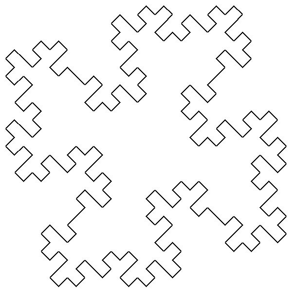
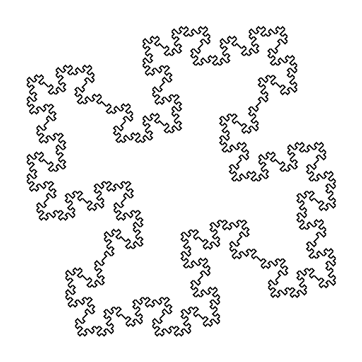

# Examples of quadratic Koch islands

* Axiom: __F-F-F-F__
* Product: __F to F-F+F+FF-F-F+F__

## Quadratic Koch island n=0

## Quadratic Koch island n=1

## Quadratic Koch island n=2

## Quadratic Koch island n=3
